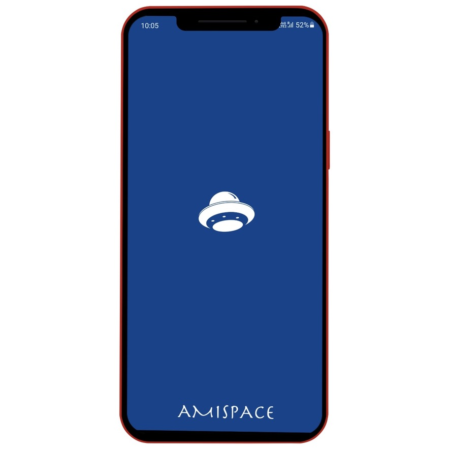
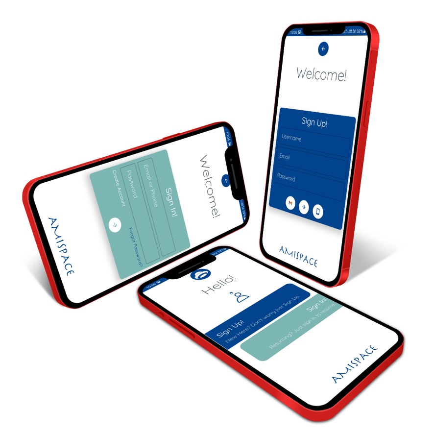
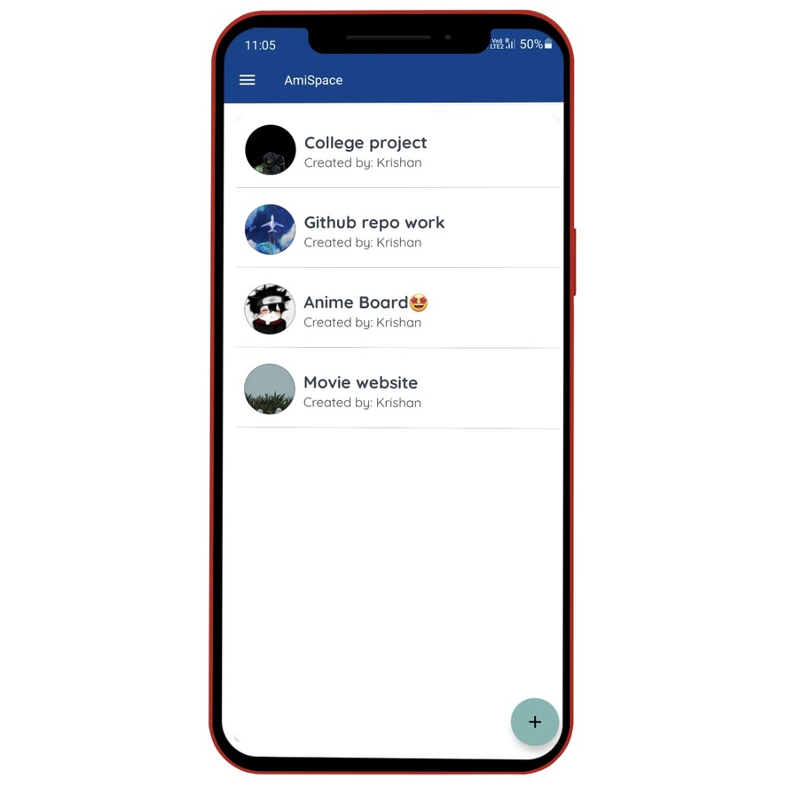
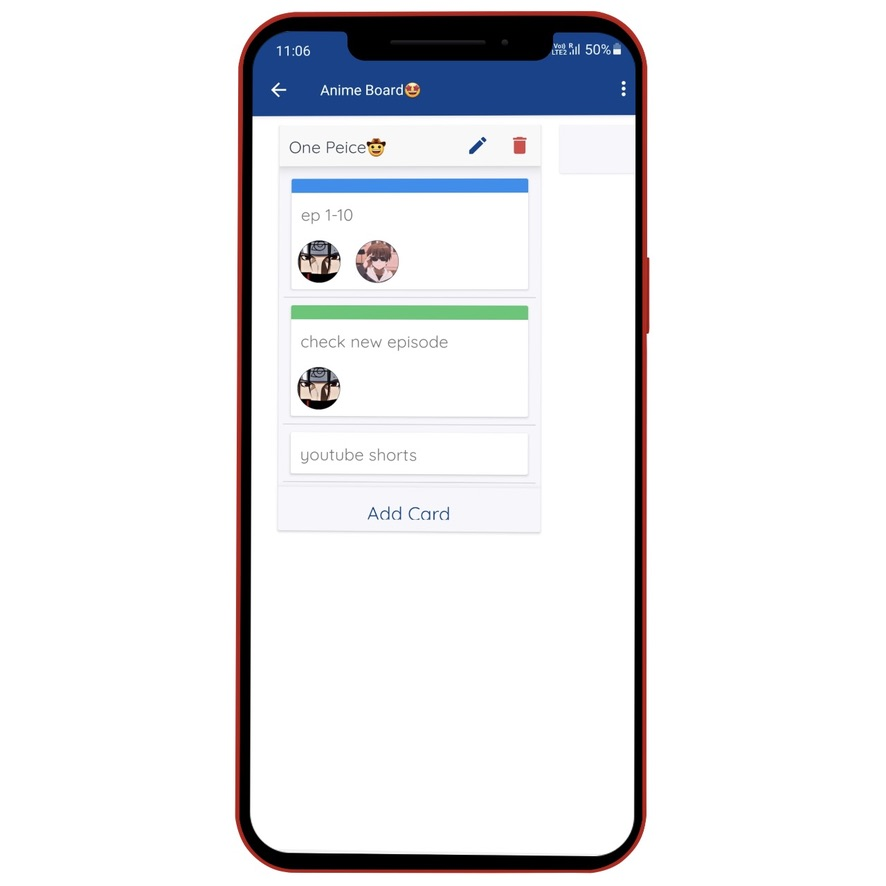
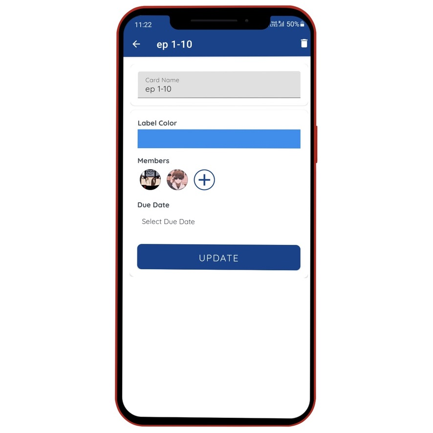

# AmiSpace

AmiSpace is a native android app in Kotlin. It is a Trello clone (Project Managemnt app) with some of it's feature.
It is a good option for college project, and many other features can be added like new SignIn methods, Chat section, etc.

## Features

- Email/Password LogIn
- Create boards
- Add new members to Board
- Add new lists
- Drag lists items
- Assign task to added members

## Screenshots
- Splash Screen, this the first sceen user will see.

- Login or Signup page.

- Boards which user created or got added by someone else.

- Cards in which tasks can be addded which are draggable.

- Assign members to the task, add due date, color code the card.

## Author

- [@kgdroid](https://github.com/kgdroid)
